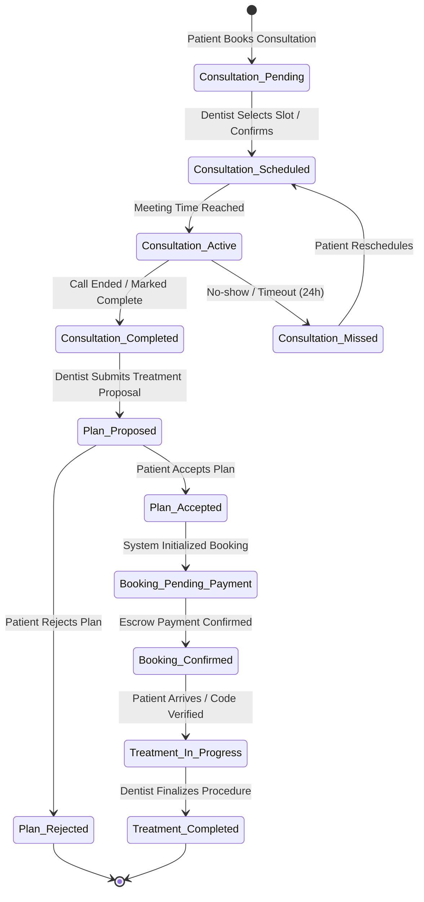

# Architecture & Schema: Dentist Consultation & Treatment Booking Lifecycle

This document outlines the system architecture, database schema, state transitions, and REST API flows for the single dentist consultation and treatment booking lifecycle.

---

## 1. Core State Machine & Business Flow

The booking lifecycle progresses through the following sequential states:



---

## 2. Edge Case Analysis & Technical Design

### A. Real-Time Video Call Integration (ZegoCloud Prebuilt Kit)
* **Why ZegoCloud UIKits?**
  * Provides prebuilt user interfaces for voice and video calls with built-in camera/microphone controls, client-side screen layout, and call ending handlers.
  * No complex WebRTC/SFU backend infrastructure is required on our server; the server's role is limited to securing room authorization tokens.
* **Flow:**
  1. A unique `roomId` is generated on backend when state changes to `SCHEDULED`.
  2. When the call is active, frontend requests a ZegoCloud token from `/api/v1/consultations/:id/token`.
  3. The server generates a secure Zego RTC Token using the ZegoCloud SDK with `AppID` and `ServerSecret`.
  4. Both Patient and Dentist join the Zego room using the generated token and `roomId`.

### B. Socket.io & Real-Time Event Signaling
* To handle real-time UI updates (e.g., automatically redirecting the patient to the treatment plan screen when the dentist marks the consultation as complete, or showing live calling status), we reserve a `socketSessionId` in the schema.
* This will allow the Socket server to route signals to correct user sockets when state changes occur.

### C. Analytics and PostHog Event Tracking
* We include a `metadata` JSON field in both `Consultation` and `TreatmentBooking` to store device info, UTM campaigns, flow duration, and transition delays, making it future-proof for PostHog event captures.

### E. Timezones & Expirations
* All times are stored in UTC. We track the user's `timezone` string to display local times and manage expiration jobs (e.g., marking a meeting as missed if not joined within 24 hours of the scheduled slot).

---

## 3. Database Schema Design (Prisma)

We will introduce `Consultation` and `TreatmentBooking` models and link them to existing `Patient`, `Dentist`, and `TreatmentPlan` schemas:

```prisma
// ==========================================
// Enum Definitions (Add to schema/enum.prisma)
// ==========================================

enum ConsultationStatus {
  PENDING
  SCHEDULED
  ACTIVE
  COMPLETED
  MISSED
  CANCELLED
}

enum TreatmentBookingStatus {
  PENDING_PAYMENT
  CONFIRMED
  IN_PROGRESS
  COMPLETED
  CANCELLED
}

enum BookingPaymentStatus {
  PENDING
  IN_ESCROW
  PAID
  REFUNDED
}

// ==========================================
// Consultation Schema (Add to schema/consultation.prisma)
// ==========================================

model Consultation {
  id              String             @id @default(uuid(7))
  patientId       String             @map("patient_id")
  patient         Patient            @relation(fields: [patientId], references: [id], onDelete: Cascade)
  dentistId       String             @map("dentist_id")
  dentist         Dentist            @relation(fields: [dentistId], references: [id], onDelete: Cascade)
  
  procedureName   String             @map("procedure_name") @db.VarChar(255)
  dateTime        DateTime           @map("date_time") @db.Timestamp(6)
  durationMinutes Int                @default(15) @map("duration_minutes")
  status          ConsultationStatus @default(PENDING)
  timezone        String             @default("UTC") @db.VarChar(100)
  
  // ZegoCloud meeting identifiers
  roomId          String?            @map("room_id") @db.VarChar(255)
  meetingLink     String?            @map("meeting_link") @db.VarChar(500)
  socketSessionId String?            @map("socket_session_id") @db.VarChar(255)
  
  // Analytics / Extensibility
  metadata        Json?              @db.JsonB
  
  createdAt       DateTime           @default(now()) @map("created_at") @db.Timestamp(6)
  updatedAt       DateTime           @updatedAt @map("updated_at") @db.Timestamp(6)
  
  treatmentPlan   TreatmentPlan?

  @@index([patientId])
  @@index([dentistId])
  @@index([status])
  @@map("consultations")
}

// ==========================================
// TreatmentBooking Schema (Add to schema/booking.prisma)
// ==========================================

model TreatmentBooking {
  id              String                 @id @default(uuid(7))
  treatmentPlanId String                 @unique @map("treatment_plan_id")
  treatmentPlan   TreatmentPlan          @relation(fields: [treatmentPlanId], references: [id], onDelete: Cascade)
  patientId       String                 @map("patient_id")
  patient         Patient                @relation(fields: [patientId], references: [id], onDelete: Cascade)
  dentistId       String                 @map("dentist_id")
  dentist         Dentist                @relation(fields: [dentistId], references: [id], onDelete: Cascade)
  
  status          TreatmentBookingStatus @default(PENDING_PAYMENT)
  paymentStatus   BookingPaymentStatus   @default(PENDING) @map("payment_status")
  escrowAmount    Decimal                @map("escrow_amount") @db.Decimal(10, 2)
  
  scheduledDate   DateTime?              @map("scheduled_date") @db.Timestamp(6)
  durationDays    Int?                   @map("duration_days")
  
  arrivalCode     String?                @map("arrival_code") @db.VarChar(50)
  paymentCode     String?                @map("payment_code") @db.VarChar(50)
  
  socketSessionId String?                @map("socket_session_id") @db.VarChar(255)
  metadata        Json?                  @db.JsonB
  
  createdAt       DateTime               @default(now()) @map("created_at") @db.Timestamp(6)
  updatedAt       DateTime               @updatedAt @map("updated_at") @db.Timestamp(6)

  @@index([patientId])
  @@index([dentistId])
  @@index([status])
  @@map("treatment_bookings")
}
```

---

## 4. API Endpoints & RBAC Actions

All endpoints are guarded by token validation middleware and enforce role-based permissions:

| Endpoint | Method | Role Required | Description |
| :--- | :--- | :--- | :--- |
| `/api/v1/consultations/book` | `POST` | `PATIENT` | Books an initial pending consultation. |
| `/api/v1/consultations` | `GET` | `PATIENT`, `DENTIST` | Retrieves consultation requests list filtered by state. |
| `/api/v1/consultations/:id/schedule` | `PATCH` | `DENTIST` | Dentist approves the date/time slot; generates Zego roomId. |
| `/api/v1/consultations/:id/token` | `GET` | `PATIENT`, `DENTIST` | Requests secure RTC session token for the video room. |
| `/api/v1/consultations/:id/complete` | `PATCH` | `DENTIST` | Marks call completed. Shifts state to allow treatment estimation. |
| `/api/v1/treatment-plans/propose` | `POST` | `DENTIST` | Proposes custom treatment estimation with cost breakdown. |
| `/api/v1/treatment-plans/:id/decision` | `PATCH` | `PATIENT` | Patient accepts or rejects plan; triggers payment flow setup. |
| `/api/v1/treatment-bookings/create` | `POST` | `PATIENT` | Creates booking instance post escrow deposit confirmation. |
| `/api/v1/treatment-bookings/:id/arrive` | `POST` | `DENTIST` | Verifies arrival code to transition status to `IN_PROGRESS`. |
| `/api/v1/treatment-bookings/:id/complete` | `POST` | `DENTIST` | Dentist completes procedure; unlocks escrow payout. |
